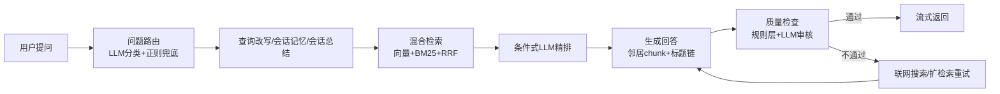

<div align="center">
  <h1>
    <span style="font-size: 3rem; font-weight: 700; background: linear-gradient(135deg, #e8623a 0%, #f49b7a 50%, #e8623a 100%); -webkit-background-clip: text; -webkit-text-fill-color: transparent; background-clip: text;">
      KnowBase
    </span>
  </h1>
  <p style="font-size: 1.15rem; color: #a0a0a0; max-width: 560px; margin: 0.5rem auto 1.5rem;">
    本地优先的知识库问答助手 — <strong>React + FastAPI</strong> 前后端分离架构，<br>基于 <strong>LangChain + LangGraph</strong> 构建 RAG 工作流
  </p>

  <p>
    <a href="#功能亮点">功能亮点</a> •
    <a href="#快速开始">快速开始</a> •
    <a href="#项目结构">项目结构</a> •
    <a href="#rag-工作流">RAG 工作流</a> •
    <a href="#测试">测试</a> •
    <a href="#技术栈">技术栈</a>
  </p>

  <br>

  <!-- Shields Row 1 -->
  <p>
    
    
    
    
  </p>
  <!-- Shields Row 2 -->
  <p>
    
    
    
    
  </p>

  <br>

  <!-- Hero GIF / Screenshot placeholder -->
  <p>
    
  </p>

  <br>

  <blockquote style="border-left: 4px solid #e8623a; margin: 1.5rem auto; padding: 0.75rem 1.25rem; max-width: 600px; text-align: left; background: #1a1a2e; border-radius: 6px;">
    如果你想要一个带现代前端体验的本地知识库，而不是只有检索链路没有产品化交互的 demo，这个项目就是为此设计的。
  </blockquote>
</div>

<br>
<br>

---

## ✨ 功能亮点

<table>
  <thead>
    <tr>
      <th width="160">模块</th>
      <th>能力</th>
    </tr>
  </thead>
  <tbody>
    <tr>
      <td><strong>💬 对话体验</strong></td>
      <td>SSE 流式输出，支持引用编号 <code>[1]</code>、重新回答、更简洁、继续追问</td>
    </tr>
    <tr>
      <td><strong>📥 知识导入</strong></td>
      <td>支持 <code>.txt</code> / <code>.md</code> / <code>.pdf</code> / <code>.docx</code> / <code>.html</code> 上传，以及 URL 一键导入</td>
    </tr>
    <tr>
      <td><strong>📂 工作区系统</strong></td>
      <td>多工作区隔离管理，每个工作区拥有独立对话和书签</td>
    </tr>
    <tr>
      <td><strong>📖 知识浏览</strong></td>
      <td>杂志式藏书阁布局，支持分页懒加载、热点高亮、网格/切片双视图</td>
    </tr>
    <tr>
      <td><strong>🔍 可解释性</strong></td>
      <td>交互式来源标签、证据可信度解释、点击引用直达原文</td>
    </tr>
    <tr>
      <td><strong>🛠️ 调试能力</strong></td>
      <td>内置 RAG Debug 面板，可查看召回、精排、质量检查全链路</td>
    </tr>
    <tr>
      <td><strong>⚡ 检索策略</strong></td>
      <td>四种策略（快速/标准/严谨/深度），偏好持久化到 localStorage</td>
    </tr>
    <tr>
      <td><strong>📱 移动端</strong></td>
      <td>响应式布局、底部导航栏、浮动上传按钮</td>
    </tr>
  </tbody>
</table>

### RAG 能力

- **查询改写** — 会话记忆、会话总结、模糊提示协同工作
- **混合检索** — Chroma 本地向量检索 + BM25 候选召回 + RRF 融合排序
- **条件精排** — LLM 精排按需触发，减少不必要的高成本步骤
- **自适应召回** — 按文档规模动态调整候选数（30 到 100）
- **上下文补全** — 邻居 chunk 补全 + 标题追踪，提升回答连贯性
- **质量兜底** — 质量检查失败后自动联网搜索或扩检索重试

### 前端体验

- 杂志编辑风 UI，全局噪声纹理质感
- 深色 / 浅色双主题，切换平滑过渡
- 来源固定与排除，状态跨消息保持
- 上传后自动生成建议问题 + 引导 banner
- 首次使用引导、无答案兜底、骨架屏复用
- `prefers-reduced-motion` 无障碍动画控制
- 组件级 Error Boundary，单视图崩溃不影响整体

<br>

---

## 🚀 快速开始

### 配置环境变量

<details>
<summary><strong>从模板创建 <code>backend/.env</code></strong></summary>

```bash
# macOS / Linux
cp backend/.env.example backend/.env

# Windows PowerShell
Copy-Item backend\.env.example backend\.env
```

然后按需编辑：

```env
SILICONFLOW_API_KEY=你的硅基流动密钥
SILICONFLOW_BASE_URL=https://api.siliconflow.cn/v1
LLM_MODEL=deepseek-ai/DeepSeek-V4-Flash
EMBEDDING_MODEL=BAAI/bge-m3

# 可选
TAVILY_API_KEY=tvly-xxx
API_KEY=your-secret-key
LANGSMITH_API_KEY=lsv2-xxx
```

> `API_KEY` 为空时会跳过 Bearer Token 鉴权，适合本地开发。
</details>

### 启动项目

| 方式 | 命令 |
|------|------|
| **一键启动** | `bash scripts/dev.sh`（macOS/Linux）或 `scripts\dev.bat`（Windows） |
| **后端单独** | `cd backend && uv run uvicorn src.api.main:app --reload --port 8000` |
| **前端单独** | `cd frontend && npm run dev` |

打开 [http://localhost:5173](http://localhost:5173) 🎉

### 使用流程

```
1. 导入文档或网页内容  →  2. 在工作区中提问  →  3. 查看引用证据  →  4. 调试优化  →  5. 收藏复用
```

<br>

---

## 🧠 RAG 工作流



### 检索策略

| 策略 | 说明 |
|------|------|
| `fast` | 无重排，最快响应，适合简单事实性问题 |
| `balanced` | 智能判断是否需要重排，适合大多数情况 |
| `high_quality` | 强制重排 + 质量检查，质量优先 |
| `deep` | 扩检索 + 综合回答，需要全面覆盖时使用 |

<br>

---

## 📁 项目结构

```
KnowBase/
├── backend/                          # FastAPI 后端
│   ├── config/settings.py            # pydantic-settings 配置入口
│   ├── migrations/                   # Alembic 数据库迁移
│   ├── src/
│   │   ├── api/                      # 路由层（routes/* + ChatStreamService）
│   │   ├── graph.py                  # LangGraph 图定义
│   │   ├── graph_nodes.py            # 工作流节点函数
│   │   ├── graph_routing.py          # 条件路由函数
│   │   ├── graph_utils.py            # 工作流工具函数
│   │   ├── graph_state.py            # GraphState + Pydantic 决策模型
│   │   ├── knowledge_base.py         # 门面类（Ingestion/Retriever/HotspotTracker）
│   │   ├── kb_models.py              # 检索结果数据类
│   │   ├── conversations.py          # 对话/工作区/书签/pin 状态 CRUD
│   │   ├── loaders.py                # 多格式文档加载器
│   │   ├── web_search.py             # Tavily 联网搜索
│   │   ├── metrics.py                # 查询 JSONL 日志
│   │   ├── chat_utils.py             # 节点标签/指标记录
│   │   └── utils.py                  # 文件上传校验
│   └── tests/                        # 30+ 文件 · 441 用例
├── frontend/                         # React 19 + Vite + Tailwind
│   └── src/
│       ├── components/
│       │   ├── browser/              # 7 个组件（GridView/SliceView 等）
│       │   ├── sidebar/              # ConversationList/DocumentPanel 等
│       │   ├── ui/                   # shadcn/ui 组件库
│       │   ├── ChatArea.tsx          # 对话界面
│       │   ├── BrowserPage.tsx       # 知识库浏览
│       │   ├── MessageBubble.tsx     # 消息气泡
│       │   ├── DebugPanel.tsx        # RAG 调试面板
│       │   ├── DashboardPage.tsx     # 指标面板
│       │   └── ErrorBoundary.tsx     # 组件级错误边界
│       ├── hooks/                    # useChat / useData / useTheme
│       └── lib/                      # api.ts / api-types.ts
│   ├── data/                         # chroma_db / checkpoints.db / conversations.db
├── docs/tests/                       # 12 份测试文档
└── scripts/                          # 一键启动脚本
```

<br>

---

## 📡 API 端点

<details>
<summary><strong>对话与消息</strong></summary>

| 端点 | 功能 |
|------|------|
| `POST /api/chat/stream` | SSE 流式聊天 |
| `GET/POST/DELETE /api/conversations` | 对话 CRUD |
| `PATCH /api/conversations/:id` | 对话重命名 |
| `GET /api/conversations/:id/messages` | 消息列表 |
| `GET /api/conversations/:id/pin-state` | Pin/exclude 状态 |
| `POST /api/conversations/:id/messages/:msg_id/feedback` | 消息反馈 |
| `GET /api/conversations/:id/export` | Markdown/JSON 导出 |

</details>

<details>
<summary><strong>文档与知识库</strong></summary>

| 端点 | 功能 |
|------|------|
| `POST /api/documents/upload` | 文件上传（流式读取） |
| `POST /api/documents/ingest-url` | URL 导入 |
| `DELETE /api/documents/source/:name` | 删除来源 |
| `POST /api/documents/clear` | 清空知识库 |
| `GET /api/knowledge-base/stats` | 统计信息 |
| `GET /api/knowledge-base/chunks` | 分页浏览 |
| `GET /api/knowledge-base/chunks/{chunk_id}` | 单 chunk 直查 |
| `GET /api/knowledge-base/sources` | 来源列表 |
| `GET /api/knowledge-base/config` | 知识库配置 |
| `GET /api/knowledge-base/hotspots` | 热点追踪 |

</details>

<details>
<summary><strong>工作区与指标</strong></summary>

| 端点 | 功能 |
|------|------|
| `GET/POST/PATCH/DELETE /api/workspaces` | 工作区 CRUD |
| `GET/POST/DELETE /api/bookmarks` | 书签 CRUD |
| `GET /api/metrics/logs` | 查询日志 |
| `DELETE /api/metrics/logs/today` | 删除今日日志 |
| `GET /api/health` | 健康检查 |

</details>

<br>

---

## ✅ 测试

<table>
  <tr>
    <th width="140"></th>
    <th width="100">文件</th>
    <th width="100">用例</th>
    <th>运行命令</th>
  </tr>
  <tr>
    <td><strong>后端</strong></td>
    <td align="center">30+</td>
    <td align="center">441</td>
    <td><code>cd backend && uv run python -m unittest discover -v</code></td>
  </tr>
  <tr>
    <td><strong>前端</strong></td>
    <td align="center">22</td>
    <td align="center">195</td>
    <td><code>cd frontend && npm test</code></td>
  </tr>
</table>

**详细测试文档** → [docs/tests/](docs/tests/)

| 文档 | 内容 | 文档 | 内容 |
|------|------|------|------|
| [01 单元测试](docs/tests/01-unit-test.md) | 用例清单 | [07 缺陷报告](docs/tests/07-defect-report.md) | 报告模板 |
| [02 集成测试](docs/tests/02-integration-test.md) | 跨模块集成 | [08 测试报告](docs/tests/08-test-report.md) | 报告模板 |
| [03 冒烟测试](docs/tests/03-smoke-test.md) | 核心功能 | [09 性能测试](docs/tests/09-performance-test.md) | 负载测试 |
| [04 边界测试](docs/tests/04-edge-test.md) | 异常场景 | [10 安全测试](docs/tests/10-security-test.md) | 安全测试 |
| [05 API 测试](docs/tests/05-api-test.md) | 端点全覆盖 | [11 E2E 测试](docs/tests/11-e2e-test.md) | Playwright |
| [06 验收测试](docs/tests/06-acceptance-test.md) | E2E 场景 | [12 CI 配置](docs/tests/12-ci-test.md) | CI 配置 |

<br>

---

## 🛠️ 技术栈

| 类别 | 技术 |
|------|------|
| **前端框架** | React 19 + TypeScript |
| **构建工具** | Vite 6 |
| **UI 组件** | shadcn/ui + Radix UI + Tailwind CSS |
| **动效** | framer-motion |
| **图标** | lucide-react |
| **字体** | Instrument Serif / Inter Tight / JetBrains Mono |
| **后端框架** | FastAPI + uvicorn |
| **流式传输** | SSE (`sse-starlette`) |
| **AI 工作流** | LangChain + LangGraph |
| **向量库** | Chroma（本地） |
| **搜索引擎** | BM25（jieba + rank-bm25） |
| **检索融合** | RRF 倒数排序融合 |
| **数据库迁移** | Alembic |
| **追踪** | LangSmith（可选） |

<br>

---

## 🏗️ 架构速览

```
┌─────────────────────────────────────────────────────────────────┐
│                      React 19 Frontend                          │
│  ┌─────────┐ ┌──────────┐ ┌─────────────┐ ┌────────────────┐   │
│  │ Chat    │ │ Browser  │ │ Dashboard   │ │ Debug Panel    │   │
│  │ Area    │ │ Page     │ │ Page        │ │                │   │
│  └────┬────┘ └────┬─────┘ └──────┬──────┘ └───────┬────────┘   │
│       └───────────┴──────────────┴────────────────┘            │
│                           │ SSE / REST                          │
├───────────────────────────┴─────────────────────────────────────┤
│                       FastAPI Backend                           │
│  ┌──────────┐ ┌──────────┐ ┌──────────┐ ┌──────────────────┐   │
│  │ Chat     │ │ Document │ │ Metrics  │ │ Knowledge Base   │   │
│  │ Stream   │ │ Ingest   │ │          │ │ (Chroma + BM25)  │   │
│  └────┬─────┘ └────┬─────┘ └────┬─────┘ └────────┬─────────┘   │
│       └────────────┴────────────┴─────────────────┘             │
│                           │ LangGraph                            │
│  ┌────────────────────────────────────────────────────────────┐  │
│  │  rewrite  →  retrieve  →  rerank  →  generate  →  check   │  │
│  └────────────────────────────────────────────────────────────┘  │
├──────────────────────────────────────────────────────────────────┤
│  SQLite · Chroma · SiliconFlow API · Tavily (optional)           │
└──────────────────────────────────────────────────────────────────┘
```

<br>

---

## 📐 关键设计决策

<details>
<summary><strong>ChatStreamService</strong> — SSE 流式编排</summary>

SSE 流式编排从路由层提取为独立 Service 类，`event_generator` 闭包拆分为 `_stream_updates`、`_process_updates`、`_process_messages`、`_emit_completion`、`_persist` 等可测试方法。路由层仅保留 27 行代码。
</details>

<details>
<summary><strong>Pin/Exclude 独立表</strong> — 来源状态持久化</summary>

来源固定/排除状态从 `debug_info` JSON blob 迁至独立 `pinned_sources` 表，前端通过 `/pin-state` 端点获取，支持独立查询和索引。
</details>

<details>
<summary><strong>BrowserPage 拆分</strong> — 单体组件重构</summary>

913 行的单体组件拆为 7 个子组件 + 1 个编排壳（`components/browser/`），各子组件职责清晰，<200 行。
</details>

<details>
<summary><strong>Alembic 迁移</strong> — 数据库版本管理</summary>

替代原有的 `try/except ALTER TABLE` 模式，提供版本化 schema 管理，初始迁移捕获当前全量 schema。
</details>

<br>

---

<div align="center">
  <sub>
    Built with React 19, FastAPI, LangChain, and Chroma ·
    <a href="https://github.com/wswhhhc/KnowBase/issues">反馈问题</a> ·
    <a href="https://github.com/wswhhhc/KnowBase/pulls">提交 PR</a>
  </sub>
  <br>
  <sub>MIT License</sub>
</div>
