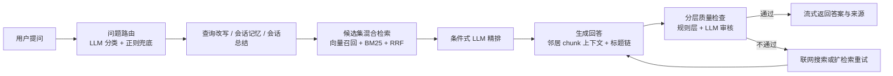

# KnowBase

<div align="center">

本地优先的知识库问答助手，采用 **React + FastAPI** 前后端分离架构，基于 **LangChain + LangGraph** 构建 RAG 工作流。  
支持多工作区、书签收藏、来源追踪、RAG 调试和流式回答，兼顾可用性与工程可维护性。

<p>
  
  
  
  
  
</p>

<p>
  <a href="#功能亮点">功能亮点</a> •
  <a href="#快速开始">快速开始</a> •
  <a href="#项目结构">项目结构</a> •
  <a href="#rag-工作流">RAG 工作流</a> •
  <a href="#测试">测试</a> •
  <a href="#技术栈">技术栈</a>
</p>

</div>

> [!TIP]
> 如果你想要一个带现代前端体验的本地知识库，而不是只有检索链路没有产品化交互的 demo，这个项目就是为此设计的。

## 功能亮点

### 产品体验

| 模块 | 能力 |
|------|------|
| 对话体验 | SSE 流式输出，支持引用编号 `[1]`、重新回答、更简洁、继续追问 |
| 知识导入 | 支持 `.txt` / `.md` / `.pdf` / `.docx` / `.html` 上传，以及 URL 一键导入 |
| 工作区系统 | 多工作区隔离管理，每个工作区拥有独立对话和书签 |
| 知识浏览 | 杂志式藏书阁布局，支持分页懒加载、热点高亮、网格/切片双视图 |
| 可解释性 | 交互式来源标签、证据可信度解释、点击引用直达原文 |
| 调试能力 | 内置 RAG Debug 面板，可查看召回、精排、质量检查全链路 |
| 检索策略 | 四种策略快速/标准/严谨/深度，偏好持久化到 localStorage |
| 移动端 | 响应式布局、底部导航栏、浮动上传按钮 |

### RAG 能力

- 查询改写、会话记忆、会话总结、模糊提示协同工作
- Chroma 本地向量检索 + BM25 候选召回 + RRF 融合排序
- 条件式 LLM 精排，减少不必要的高成本步骤
- 自适应向量召回，按文档规模动态调整候选数（30 到 100）
- 邻居 chunk 上下文补全 + 标题追踪，提升回答连贯性
- 质量检查失败后，可触发联网搜索兜底或扩检索重试

### 前端体验

- 杂志编辑风 React UI
- 移动端适配：抽屉侧栏 + 底部导航 + 响应式头部
- 来源固定与排除，状态跨消息保持
- 上传后自动生成建议问题 + 引导 banner
- 首次使用引导、无答案兜底、骨架屏复用、`prefers-reduced-motion` 支持
- 浅色 / 深色主题切换
- 组件级 Error Boundary，单视图崩溃不影响整体

## 架构速览

| 层 | 说明 |
|----|------|
| 前端 | React 19 + TypeScript + Vite + Tailwind，负责对话、知识浏览、调试和指标界面 |
| 后端 | FastAPI 提供 REST API 与 SSE 流式响应 |
| 工作流 | LangGraph 编排查询改写、检索、精排、生成、质量检查 |
| 存储 | Chroma 本地向量库 + SQLite（对话/书签/工作区/pin 状态）+ JSONL 查询日志 |
| 检索 | 向量召回、BM25、RRF 融合、条件式重排 |
| 外部能力 | 硅基流动 API 提供 LLM 与 Embedding；Tavily 可选兜底联网搜索 |

## 快速开始

### 1. 配置环境变量

先从模板创建 `backend/.env`：

```bash
cp backend/.env.example backend/.env
```

Windows PowerShell:

```powershell
Copy-Item backend\.env.example backend\.env
```

然后按需编辑：

```env
SILICONFLOW_API_KEY=你的硅基流动密钥
SILICONFLOW_BASE_URL=https://api.siliconflow.cn/v1
LLM_MODEL=deepseek-ai/DeepSeek-V4-Flash
EMBEDDING_MODEL=BAAI/bge-m3

# 可选
TAVILY_API_KEY=tvly-xxx
API_KEY=your-secret-key
LANGSMITH_API_KEY=lsv2-xxx
```

> [!NOTE]
> `API_KEY` 为空时会跳过 Bearer Token 鉴权，适合本地开发。

### 2. 一键启动

```bash
# macOS / Linux
bash scripts/dev.sh

# Windows
scripts\dev.bat
```

默认启动后端 `8000` 和前端 `5173`。  
打开 [http://localhost:5173](http://localhost:5173)。

### 3. 分别启动前后端

```bash
# backend
cd backend
uv run uvicorn src.api.main:app --reload --port 8000
```

```bash
# frontend
cd frontend
npm run dev
```

## 使用流程

1. 上传本地文档或导入网页内容
2. 在工作区中发起问题
3. 通过引用编号查看证据来源
4. 必要时展开 Debug 面板检查检索链路
5. 收藏高价值片段到书签，跨对话继续复用

## RAG 工作流



### 检索策略

项目支持四种检索策略：

- `fast` — 无重排，最快响应，适合简单事实性问题
- `balanced` — 智能判断是否需要重排，适合大多数情况
- `high_quality` — 强制重排 + 质量检查，质量优先
- `deep` — 扩检索 + 综合回答，需要全面覆盖时使用

## 项目结构

```text
KnowBase/
├── backend/                    # FastAPI 后端
│   ├── config/
│   │   └── settings.py         # pydantic-settings 配置
│   ├── migrations/             # Alembic 数据库迁移
│   │   ├── versions/
│   │   │   └── 001_initial_schema.py
│   │   ├── env.py
│   │   └── script.py.mako
│   ├── src/
│   │   ├── api/
│   │   │   ├── main.py         # 应用入口 + CORS + lifespan
│   │   │   ├── deps.py         # 依赖注入
│   │   │   ├── models.py       # Pydantic 模型
│   │   │   ├── chat_stream_service.py  # SSE 流编排 (ChatStreamService)
│   │   │   └── routes/
│   │   │       ├── chat.py
│   │   │       ├── conversations.py
│   │   │       ├── documents.py
│   │   │       ├── knowledge_base.py
│   │   │       ├── metrics.py
│   │   │       ├── workspaces.py
│   │   │       └── bookmarks.py
│   │   ├── graph.py            # LangGraph 图定义
│   │   ├── graph_nodes.py      # 工作流节点函数
│   │   ├── graph_routing.py    # 条件路由函数
│   │   ├── graph_utils.py      # 工作流工具函数
│   │   ├── graph_state.py      # GraphState + Pydantic 决策模型
│   │   ├── knowledge_base.py   # 门面类（IngestionService / Retriever / HotspotTracker）
│   │   ├── kb_models.py        # 检索结果数据类
│   │   ├── conversations.py    # 对话/工作区/书签/pin 状态 CRUD（SQLite）
│   │   ├── loaders.py          # 多格式文档加载器
│   │   ├── web_search.py       # Tavily 联网搜索
│   │   ├── metrics.py          # 查询 JSONL 日志
│   │   ├── chat_utils.py       # 节点标签/指标记录/标题生成
│   │   └── utils.py            # 文件上传校验
│   ├── alembic.ini
│   └── tests/                  # 30+ 文件，440+ 用例
├── frontend/                   # React 19 + Vite + Tailwind
│   └── src/
│       ├── components/
│       │   ├── browser/        # BrowserPage 拆分：GridView/SliceView/SearchToolbar 等 7 个组件
│       │   ├── sidebar/        # ConversationList / DocumentPanel / KBSummary / DashboardSummary
│       │   ├── ui/             # shadcn/ui（含 SkeletonCard/SkeletonGrid）
│       │   ├── ChatArea.tsx    # 对话界面（搜索策略选择器 + 持久化）
│       │   ├── Sidebar.tsx     # 侧栏导航（视图/工作区/主题切换）
│       │   ├── BrowserPage.tsx # 知识库浏览（薄编排层）
│       │   ├── DashboardPage.tsx
│       │   ├── EmptyState.tsx
│       │   ├── MessageBubble.tsx
│       │   └── DebugPanel.tsx
│       ├── hooks/              # useChat / useData / useTheme
│       └── lib/                # api.ts / api-types.ts / api-types.generated.ts
│   ├── data/                   # chroma_db / checkpoints.db / conversations.db / logs
├── docs/
│   └── tests/                  # 12 份测试文档
└── scripts/                    # 一键启动脚本
```

## API 端点

### 对话与消息

| 端点 | 功能 |
|------|------|
| `POST /api/chat/stream` | SSE 流式聊天（`node` / `token` / `sources` / `debug` / `done`） |
| `GET/POST/DELETE /api/conversations` | 对话 CRUD |
| `PATCH /api/conversations/:id` | 对话重命名 |
| `GET /api/conversations/:id/messages` | 获取消息列表（含 pin 状态注入） |
| `GET /api/conversations/:id/pin-state` | 获取对话的 pin/exclude 状态 |
| `POST /api/conversations/:id/messages/:msg_id/feedback` | 消息反馈 |
| `GET /api/conversations/:id/export` | Markdown / JSON 导出 |

### 文档与知识库

| 端点 | 功能 |
|------|------|
| `POST /api/documents/upload` | 文件上传（流式读取） |
| `POST /api/documents/ingest-url` | URL 导入 |
| `DELETE /api/documents/source/:name` | 删除来源 |
| `POST /api/documents/clear` | 清空知识库 |
| `GET /api/knowledge-base/stats` | 统计信息 |
| `GET /api/knowledge-base/chunks` | 分页浏览知识片段 |
| `GET /api/knowledge-base/chunks/{chunk_id}` | 单 chunk 直查 |
| `GET /api/knowledge-base/sources` | 来源列表 |
| `GET /api/knowledge-base/config` | 知识库配置 |
| `GET /api/knowledge-base/hotspots` | 热点追踪 |

### 工作区与指标

| 端点 | 功能 |
|------|------|
| `GET/POST/PATCH/DELETE /api/workspaces` | 工作区 CRUD |
| `GET/POST/DELETE /api/bookmarks` | 书签 CRUD |
| `GET /api/metrics/logs` | 查询日志 |
| `DELETE /api/metrics/logs/today` | 删除今日日志 |
| `GET /api/health` | 健康检查 |

## 测试

### 后端测试

Python `unittest`，共 **30+ 测试文件 / 441 个用例**。

```bash
cd backend

uv run python -m unittest discover -v
uv run python -m unittest tests.test_api_endpoints -v
uv run python -m unittest tests.test_edge_cases -v
uv run python -m unittest tests.test_integration_graph_kb -v
uv run python -m unittest tests.test_smoke -v
uv run python -m unittest tests.test_graph -v
uv run python -m unittest tests.test_knowledge_base -v
uv run python -m unittest tests.test_conversations -v
uv run python -m unittest tests.test_chat_route -v
uv run python -m unittest tests.test_routing -v
```

### 前端测试

Vitest，共 **22 测试文件 / 195 个用例**。

```bash
cd frontend

npm test
npm run test:watch
npm run test:coverage
```

### 测试文档

详见 [docs/tests/](docs/tests/)：

| 文档 | 内容 |
|------|------|
| [01-unit-test.md](docs/tests/01-unit-test.md) | 单元测试用例清单 |
| [02-integration-test.md](docs/tests/02-integration-test.md) | 跨模块集成测试 |
| [03-smoke-test.md](docs/tests/03-smoke-test.md) | 核心功能冒烟测试 |
| [04-edge-test.md](docs/tests/04-edge-test.md) | P2 边界 / 异常测试 |
| [05-api-test.md](docs/tests/05-api-test.md) | API 端点全覆盖 |
| [06-acceptance-test.md](docs/tests/06-acceptance-test.md) | 14 个 E2E 用户场景 |
| [07-defect-report.md](docs/tests/07-defect-report.md) | 缺陷报告模板 |
| [08-test-report.md](docs/tests/08-test-report.md) | 测试报告模板 |
| [09-performance-test.md](docs/tests/09-performance-test.md) | 性能 / 负载测试 |
| [10-security-test.md](docs/tests/10-security-test.md) | 安全测试 |
| [11-e2e-test.md](docs/tests/11-e2e-test.md) | Playwright E2E 测试 |
| [12-ci-test.md](docs/tests/12-ci-test.md) | CI 配置 |

## 技术栈

| 层 | 技术 |
|----|------|
| 前端框架 | React 19 + TypeScript |
| 构建工具 | Vite 6 |
| UI 组件 | shadcn/ui + Radix UI + Tailwind CSS |
| 动效 | framer-motion |
| 图标 | lucide-react |
| 字体 | Instrument Serif / Inter Tight / JetBrains Mono |
| 后端框架 | FastAPI + uvicorn |
| 流式传输 | SSE (`sse-starlette`) |
| AI 工作流 | LangChain + LangGraph |
| 向量库 | Chroma（本地） |
| 搜索引擎 | BM25（`jieba` + `rank-bm25`） |
| 检索融合 | RRF 倒数排序融合 |
| 数据库迁移 | Alembic |
| 追踪 | LangSmith（可选） |

## 关键设计决策

- **ChatStreamService** — SSE 流式编排从路由层提取为独立 Service 类，`event_generator` 闭包拆分为 `_stream_updates`、`_process_updates`、`_process_messages`、`_emit_completion`、`_persist` 等可测试方法
- **Pin/Exclude 独立表** — 来源固定/排除状态从 `debug_info` JSON blob 迁至独立 `pinned_sources` 表，前端通过 `/pin-state` 端点获取
- **BrowserPage 拆分** — 913 行的单体组件拆为 7 个子组件 + 1 个编排壳
- **Alembic 迁移** — 替代原有 `try/except ALTER TABLE`，提供版本化 schema 管理

---

如果你正在把它作为一个可继续演进的 RAG 产品骨架，这个 README 现在应该更接近你希望别人第一次打开仓库时看到的样子。
