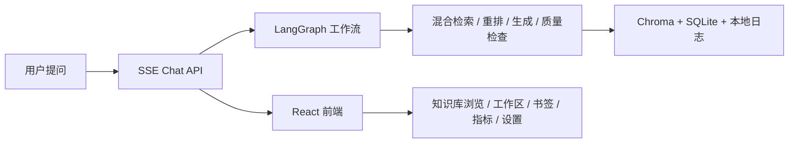

<div align="center">
  <h1>KnowBase</h1>
  <p>本地优先的知识库问答工作台，采用 React + FastAPI，围绕可维护的 RAG 开发与演示场景构建。</p>
  <p>
    
    
    
    
  </p>
</div>


当前仓库已附带一张真实截图。其余展示位不再使用占位图，待补资源见 [docs/screenshots/TODO.md](docs/screenshots/TODO.md)。

## 项目概览

KnowBase 关注的是“可持续维护的本地 RAG 应用骨架”，而不是只演示一条检索链路。当前仓库已经具备这些能力：

- SSE 流式问答，回答可附带来源片段与调试信息
- 本地文件上传与公开 URL 导入
- 知识库浏览、来源列表、热点片段与调试检索
- 工作区、对话、书签与运行时设置
- 本地查询日志与指标面板
- OpenAPI 快照与前端生成类型的契约同步

## 工作区语义

“工作区”是当前版本里最容易被过度承诺的概念，这里明确说明：

- 工作区会作用于对话、书签，以及知识库导入/查询时传递的 `workspace_id`
- 它是应用层的作用域组织方式，不是安全边界，也不是多租户隔离方案
- 删除工作区时，对话和书签会回落到默认工作区；已导入知识库数据的迁移/清理仍需显式处理

如果你要做公开演示，可以把它理解成“本地知识工作流分组”，而不是“租户级隔离”。

## 快速开始

### 前置要求

- Python 3.11+，推荐 3.12
- Node.js 20+
- `uv`
- 一个可用的 `SILICONFLOW_API_KEY`，完整问答链路需要它

### 5 分钟体验

```bash
cd backend
cp .env.example .env
# 只填必填项 SILICONFLOW_API_KEY
uv run python scripts/quickstart.py --reset
```

这个脚本会把 `examples/demo-documents/` 中的示例文档导入到隔离的 `runtime/quickstart/` 运行目录，再跑几条预置问题。只想先确认资源结构时可以运行：

```bash
cd backend
uv run python scripts/quickstart.py --dry-run
```

### 本地启动

优先使用仓库脚本：

```bash
bash scripts/dev.sh
```

Windows PowerShell:

```powershell
scripts\dev.bat
```

也可以分别启动：

```bash
cd backend
uv run uvicorn src.api.main:app --reload --port 8000
```

```bash
cd frontend
npm install
npm run dev
```

Docker 开发环境：

```bash
docker compose up --build
```

前端默认地址为 [http://localhost:5173](http://localhost:5173)。

## 质量门禁

提交前至少建议运行以下命令：

```bash
bash scripts/run-checks.sh
```

或按分步方式执行：

```bash
cd backend && uv run pytest tests --tb=short -q
cd frontend && npm test
cd frontend && npm run build
```

如果后端接口或 schema 有变更，再补这两步：

```bash
cd backend && uv run python scripts/export_openapi.py
cd frontend && npm run gen-api-types
```

GitHub Actions 当前会执行：

- 后端 `pytest`
- 前端 `npm test`
- 前端 `npm run build`
- 前端生成类型漂移检查 `npm run check-api-types`

## 契约与类型同步

仓库把 `backend/openapi.json` 视为提交态 API 快照，把 `frontend/src/lib/api-types.openapi.ts` 视为前端生成物。

- 当 FastAPI 路由或 Pydantic schema 改动时，先导出 `backend/openapi.json`
- 再重新生成前端 OpenAPI 类型
- CI 会阻止“后端契约已变但快照或前端类型未更新”的提交

手写 SSE 类型位于 `frontend/src/lib/api-types.ts`，并由后端测试校验是否与 Pydantic 模型同步。

## 结构文档

- 架构边界与依赖方向：[`docs/architecture/dependency-rules.md`](docs/architecture/dependency-rules.md)
- 后端结构说明：[`docs/architecture/backend-structure.md`](docs/architecture/backend-structure.md)
- 前端结构说明：[`docs/architecture/frontend-structure.md`](docs/architecture/frontend-structure.md)
- 产品边界与当前范围：[`docs/requirements/product-boundaries.md`](docs/requirements/product-boundaries.md)
- 运行数据策略：[`docs/operations/runtime-data-policy.md`](docs/operations/runtime-data-policy.md)
- CI 与测试矩阵：[`docs/testing/12-ci-test.md`](docs/testing/12-ci-test.md)

## 架构概览



## 仓库结构

```text
KnowBase/
├── backend/               # FastAPI、LangGraph、OpenAPI、测试
├── frontend/              # React、Vite、Vitest、生成类型
├── docs/                  # architecture / requirements / testing / operations / screenshots
├── examples/              # 版本控制下的演示与预置样例
├── runtime/               # 本地运行数据（忽略提交）
├── docker/                # Docker 构建文件
└── scripts/               # 本地开发辅助脚本
```

后端唯一 Python 应用根是 `backend/`。仓库根目录不再承担 `uv sync` / `uv run` 的 Python 项目职责。

## 当前范围与已知限制

- 当前更适合本地演示、单机场景和持续迭代开发，不是现成的 SaaS 多租户方案
- 完整回答链路依赖外部模型提供方；未配置 `SILICONFLOW_API_KEY` 时无法完成真实问答
- 鉴权只有可选的单一 `API_KEY` Bearer Token，没有 RBAC 或用户体系
- 工作区是应用层作用域，不提供租户级安全隔离
- 工作区删除不会自动完成所有知识库数据的生命周期治理

## 贡献

协作规则、提交前检查、OpenAPI 导出和前端类型生成流程见 [CONTRIBUTING.md](CONTRIBUTING.md)。
