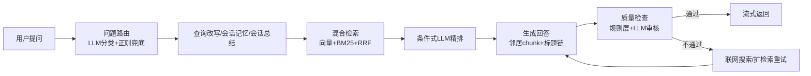

<div align="center">
  <h1>
    <span style="font-size: 3rem; font-weight: 700; background: linear-gradient(135deg, #e8623a 0%, #f49b7a 50%, #e8623a 100%); -webkit-background-clip: text; -webkit-text-fill-color: transparent; background-clip: text;">
      KnowBase
    </span>
  </h1>
  <p style="font-size: 1.15rem; color: #a0a0a0; max-width: 600px; margin: 0.5rem auto 1.5rem;">
    本地优先的知识库问答助手 — <strong>React + FastAPI</strong> 前后端分离，<br>基于 <strong>LangChain + LangGraph</strong> 构建企业级 RAG 工作流
  </p>

  <p>
    <a href="#-why-knowbase">Why KnowBase</a> •
    <a href="#-use-cases">Use Cases</a> •
    <a href="#-quick-start">Quick Start</a> •
    <a href="#-architecture">Architecture</a> •
    <a href="#-evaluation">Evaluation</a> •
    <a href="#-project-structure">Structure</a> •
    <a href="#-tech-stack">Tech Stack</a>
  </p>

  <br>

  <!-- Shields Row 1 -->
  <p>
    
    
    
    
  </p>
  <!-- Shields Row 2 -->
  <p>
    
    
    
    
  </p>

  <br>

  <!-- Screenshots -->
  <table>
    <tr>
      <td width="50%"></td>
      <td width="50%"></td>
    </tr>
    <tr>
      <td width="50%"></td>
      <td width="50%"></td>
    </tr>
  </table>

  <blockquote style="border-left: 4px solid #e8623a; margin: 1.5rem auto; padding: 0.75rem 1.25rem; max-width: 640px; text-align: left; background: #1a1a2e; border-radius: 6px;">
    如果你想要一个<strong>带现代前端体验</strong>的本地知识库，而不是只有检索链路没有产品化交互的 demo——这个项目就是为此设计的。
  </blockquote>
</div>

<br>

---

## Why KnowBase

大多数开源 RAG 项目在"检索管道的最后一步"就停了。KnowBase 不一样。

| 你的痛点 | 别人的做法 | KnowBase 的做法 |
|---------|-----------|----------------|
| 回答没有依据 | 只返回一段文本 | 引用编号 `[1]` 直达原文，展示证据可信度 |
| 检索是黑盒 | 看不到过程 | 内置 Debug 面板，展示召回→精排→质量检查全链路 |
| 不清楚质量 | 全靠 LLM 自己 | 规则层 + LLM 双重质量检查，不合格自动重试 |
| 策略一成不变 | 固定检索方式 | 四种策略（快速/标准/严谨/深度），按需切换，移动端收进弹层 |
| 不支持来源管理 | 无法控制 | 来源固定/排除持久化，跨消息保持 |
| 没有产品感 | 只是 API 或命令行 | 深色/浅色双主题、响应式移动端、流式输出；移动端上传 FAB 仅在知识库页显示 |

### 核心 RAG 能力

- **查询改写** — 会话记忆 + 会话总结 + 模糊提示协同，让问题更精准
- **混合检索** — Chroma 向量检索 + BM25 全文检索 + RRF 倒数排序融合
- **条件精排** — LLM 精排按需触发（差距大 / 短问题 / 策略 `fast` 时跳过），减少不必要的成本
- **自适应召回** — 按文档规模动态调整候选数（30 ~ 100），小库不浪费、大库不遗漏
- **上下文补全** — 邻居 chunk 拼接 + 标题链追踪，回答更连贯
- **质量兜底** — 三重机制：规则层过滤 → LLM 审核 → 不合格后联网搜索或扩检索重试（最多 `MAX_RETRIES` 次）

### 前端体验

杂志编辑风 UI、全局噪声纹理、深色/浅色双主题平滑过渡、来源固定与排除跨消息保持、上传后自动生成建议问题与引导 banner、首次使用引导和骨架屏复用、`prefers-reduced-motion` 无障碍动画控制、组件级 Error Boundary——单视图崩溃不影响整体。

<br>

---

## Use Cases

| 场景 | 说明 |
|------|------|
| **个人知识管理** | 把你的笔记、PDF、网页收藏导入同一个知识库，用自然语言提问 |
| **团队内部文档** | 多工作区隔离不同项目文档，每个工作区独立对话与书签 |
| **技术文档查询** | 导入技术文档、API 手册，代替翻页搜索 |
| **学术文献整理** | PDF 批量导入，自动分块索引，按引用 + 证据可信度评估 |
| **产品文档问答** | 接入产品文档站点，构建面向客户的自助问答助手（需部署） |

<br>

---

## Quick Start

### Prerequisites

- Python 3.11+（推荐 3.12，与 CI 一致）
- Node.js 20+
- [uv](https://docs.astral.sh/uv/)（Python 包管理器）
- 一个 [硅基流动](https://cloud.siliconflow.cn) API Key

### 5 分钟体验

```bash
cd backend
cp .env.example .env
# 只填必填项 SILICONFLOW_API_KEY
uv run python scripts/quickstart.py --reset
```

这个脚本会：

- 用 `data/samples/demo/` 里的 3 份示例文档创建一个隔离的 demo 知识库
- 把向量库和 checkpoint 写入 `backend/data/quickstart/`
- 自动跑 3 个示例问题，验证检索和回答链路

想先确认 demo 资源而不调用模型，可以运行：

```bash
cd backend
uv run python scripts/quickstart.py --dry-run
```

### 配置环境变量

```bash
cd backend
cp .env.example .env    # macOS/Linux
# 或用 PowerShell: Copy-Item .env.example .env
```

编辑 `.env`，填入你的密钥：

```env
SILICONFLOW_API_KEY=sk-你的密钥
```

> `API_KEY` 留空时跳过 Bearer Token 鉴权，适合本地开发。

`.env.example` 已按“必填 / 选填”分组；只想快速体验时，最少只需要配置 `SILICONFLOW_API_KEY`。

### 完整启动

| 方式 | 命令 |
|------|------|
| **Docker Compose** | `docker compose up --build` 或 `bash scripts/dev.sh --docker` |
| **一键启动** | `bash scripts/dev.sh` 或 `scripts\dev.bat` |
| **后端单独** | `cd backend && uv run uvicorn src.api.main:app --reload --port 8000` |
| **前端单独** | `cd frontend && npm run dev` |

打开 [http://localhost:5173](http://localhost:5173)

### 常用命令

| 场景 | 命令 |
|------|------|
| **后端测试（推荐）** | `cd backend && uv run pytest --cov --tb=short -v` |
| **后端测试（CI 兼容）** | `cd backend && uv run python -m unittest discover -v` |
| **前端测试** | `cd frontend && npm test` |
| **前端构建** | `cd frontend && npm run build` |
| **类型生成** | `cd frontend && npm run gen-api-types` |

### 使用流程

```
1. 导入文档或网页  →  2. 在工作区提问  →  3. 查看引用证据  →  4. 调试优化  →  5. 收藏复用
```

<br>

---

## Architecture

### RAG 工作流



### 分层架构

```
┌──────────────────────────────────────────────────────────────────┐
│                        React 19 Frontend                          │
│  ┌──────────┐ ┌───────────┐ ┌──────────────┐ ┌────────────────┐  │
│  │ Chat     │ │ Knowledge │ │ Dashboard    │ │ Debug Panel    │  │
│  │ Area     │ │ Browser   │ │              │ │                │  │
│  └────┬─────┘ └────┬──────┘ └──────┬───────┘ └───────┬────────┘  │
│       └────────────┴───────────────┴─────────────────┘           │
│                            │ SSE / REST                           │
├────────────────────────────┴──────────────────────────────────────┤
│                        FastAPI Backend                            │
│  ┌────────────┐ ┌──────────────┐ ┌─────────┐ ┌────────────────┐  │
│  │ ChatStream │ │ Document     │ │ Metrics │ │ Knowledge Base │  │
│  │ Service    │ │ Ingest       │ │         │ │ (Chroma+BM25)  │  │
│  └─────┬──────┘ └──────┬───────┘ └────┬────┘ └───────┬────────┘  │
│        └───────────────┴──────────────┴────────────────┘          │
│                            │ LangGraph                             │
│  ┌─────────────────────────────────────────────────────────────┐  │
│  │ rewrite → retrieve → rerank → generate → check → retry     │  │
│  └─────────────────────────────────────────────────────────────┘  │
├───────────────────────────────────────────────────────────────────┤
│  SQLite · Chroma · SiliconFlow API · Tavily (optional)             │
└───────────────────────────────────────────────────────────────────┘
```

### 检索策略

| 策略 | 触发时机 | 适用场景 |
|------|---------|---------|
| `fast` | 跳过精排 | 简单事实性问题，追求最快响应 |
| `balanced` | 智能判断（默认） | 大多数情况，性价比最优 |
| `high_quality` | 强制精排 + 质量检查 | 质量优先，速度次之 |
| `deep` | 扩检索 + 综合回答 | 需要全面覆盖时 |

<br>

---

## Evaluation

KnowBase 内置了离线评估框架（`src/evaluate.py`），支持启发式指标和 LLM-as-Judge 两种评估方式。

### 评估指标

| 指标 | 说明 | 方式 |
|------|------|------|
| `retrieval_relevance` | 是否检索到候选来源 | 启发式 |
| `groundedness` | 回答引用是否匹配预期来源 | 启发式 |
| `answer_relevance` | 回答是否非空且非拒绝 | 启发式 |
| `correctness` | 关键词匹配预期答案 | 启发式 |
| `faithfulness` | 回答是否忠于上下文不编造 | LLM-as-Judge |
| `answer_relevance_llm` | 回答是否真正回答了问题 | LLM-as-Judge |

### 最新评测结果

```json
{
  "total_cases": 3,
  "passed_cases": 3,
  "avg_elapsed_ms": 32645,
  "metrics": {
    "retrieval_relevance": { "avg_score": 1.00, "pass_rate": 100% },
    "groundedness":         { "avg_score": 0.33, "pass_rate": 33%  },
    "answer_relevance":     { "avg_score": 0.33, "pass_rate": 33%  },
    "correctness":          { "avg_score": 0.00, "pass_rate": 0%   }
  }
}
```

> **解读：** 检索召回率 100%，但 answer_relevance 和 correctness 偏低，主要原因是样本文档内容与问题覆盖度不足。这暴露了一个常见问题——**知识库的文档质量直接决定回答质量**，而非检索管道本身。`kb_unknown` 用例（知识库无相关内容）被正确识别并拒绝回答，说明系统的拒绝机制有效。

### 运行你自己的评测

```bash
cd backend
uv run python -m src.evaluate
```

报告输出到 `data/eval_reports/`，包含每个用例的分数、耗时和人工可读的评估理由。

<br>

---

## Project Structure

```
KnowBase/
├── backend/                           # FastAPI 后端（31 源文件）
│   ├── src/
│   │   ├── api/                       # 路由层 + ChatStreamService（调试/持久化独立模块）
│   │   │   ├── routes/                # 7 个路由文件（平均 <50 行）
│   │   │   ├── chat_stream_service.py # SSE 流编排（~190 行）
│   │   │   ├── chat_debug.py          # DebugState + 节点调试信息累加
│   │   │   ├── chat_persistence.py    # 对话持久化 + debug payload 序列化
│   │   │   └── deps.py                # API Key 鉴权
│   │   ├── graph/                     # LangGraph 工作流
│   │   │   ├── graph.py               # 图定义（build/compile/cache）
│   │   │   ├── nodes.py               # 工作流节点函数
│   │   │   ├── routing.py             # 条件路由逻辑
│   │   │   ├── state.py               # GraphState + Pydantic 决策模型
│   │   │   └── utils.py               # 图工具（LLM/上下文格式化/解析）
│   │   ├── rag/                       # 检索增强生成
│   │   │   ├── knowledge_base.py      # 门面类（Ingestion/Retriever/Hotspots）
│   │   │   ├── models.py              # 检索结果数据类
│   │   │   ├── loaders.py             # 多格式加载器（含 SSRF 防护）
│   │   │   └── web_search.py          # Tavily 联网搜索
│   │   ├── config/                    # 配置
│   │   │   └── settings.py           # pydantic-settings 配置
│   │   ├── evaluate.py                # 离线 RAG 质量评估
│   │   ├── metrics.py                 # 查询 JSONL 日志
│   │   ├── conversations.py           # 对话/工作区/书签/pin CRUD
│   │   ├── chat_utils.py              # LLM 标题生成/建议问题
│   │   └── utils.py                   # 通用工具（文件上传/分词/JSON 提取）
│   ├── tests/                         # 28 个文件 · 444 用例
│   ├── data/                          # chroma_db / checkpoints / conversations
│   ├── migrations/                    # Alembic 数据库迁移
│   └── scripts/quickstart.py          # 5 分钟 demo 体验脚本
├── frontend/                          # React 19 + Vite + Tailwind
│   └── src/
│       ├── components/
│       │   ├── browser/               # 7 个子组件（Grid/Slice/ChunkDetail 等）
│       │   ├── sidebar/               # 4 个侧边栏组件
│       │   └── ui/                    # 10 个 shadcn/ui 组件
│       │   ├── ChatArea.tsx           # 对话界面（动态 EmptyState、策略按钮/弹层、localStorage）
│       │   ├── BrowserPage.tsx        # 知识库浏览（杂志式布局）
│       │   ├── MessageBubble.tsx      # 消息气泡（操作主次分层 + 更多菜单）
│       │   ├── EmptyState.tsx         # 三种空状态：onboarding / first-question / returning
│       │   ├── DebugPanel.tsx         # RAG 全链路调试面板
│       │   ├── DashboardPage.tsx      # 使用统计看板
│       │   └── ErrorBoundary.tsx      # 组件级错误边界
│       ├── hooks/
│       │   ├── useChat.ts             # SSE 流式聊天 hook（委托至 chat/ 子模块）
│       │   ├── chat/                  # 类型定义 + useChatMessages + usePinnedSourcesState
│       │   ├── useData.ts / useTheme.ts / useBrowserPage.ts
│       │   └── lib/                   # api.ts / api-types.ts / api-types.openapi.ts
├── docs/tests/                        # 12 份测试文档
├── scripts/                           # 一键启动脚本
└── data/samples/demo/                 # quickstart 示例文档
```

### API 端点一览

<details>
<summary><strong>聊天与对话（8 个端点）</strong></summary>

- `POST /api/chat/stream` — SSE 流式聊天
- `GET/POST/DELETE /api/conversations` — 对话 CRUD
- `PATCH /api/conversations/:id` — 对话重命名
- `GET /api/conversations/:id/messages` — 消息列表
- `GET /api/conversations/:id/pin-state` — Pin/exclude 状态
- `POST /api/conversations/:id/messages/:msg_id/feedback` — 消息反馈
- `GET /api/conversations/:id/export` — Markdown/JSON 导出
</details>

<details>
<summary><strong>文档与知识库（9 个端点）</strong></summary>

- `POST /api/documents/upload` — 文件上传（流式读取）
- `POST /api/documents/ingest-url` — URL 导入
- `DELETE /api/documents/source/:name` — 删除来源
- `POST /api/documents/clear` — 清空知识库
- `GET /api/knowledge-base/stats` — 统计信息
- `GET /api/knowledge-base/chunks` — 分页浏览
- `GET /api/knowledge-base/chunks/{chunk_id}` — 单 chunk 直查
- `GET /api/knowledge-base/sources` — 来源列表
- `GET /api/knowledge-base/hotspots` — 热点追踪
</details>

<details>
<summary><strong>工作区与指标（5 个端点）</strong></summary>

- `GET/POST/PATCH/DELETE /api/workspaces` — 工作区 CRUD
- `GET/POST/DELETE /api/bookmarks` — 书签 CRUD
- `GET /api/metrics/logs` — 查询日志
- `DELETE /api/metrics/logs/today` — 删除今日日志
- `GET /api/health` — 健康检查
</details>

<br>

---

## Testing

| 层 | 框架 | 文件 | 用例 | 运行命令 |
|----|------|------|------|---------|
| **后端（本地推荐）** | pytest | 28 | 444 | `cd backend && uv run pytest --cov --tb=short -v` |
| **后端（GitHub CI）** | unittest discover | 28 | 444 | `cd backend && uv run python -m unittest discover -v` |
| **前端** | vitest + @testing-library/react | 23 | 206 | `cd frontend && npm test` |

说明：
- GitHub Actions 当前执行后端 `unittest discover` 与前端 `npm test`。
- 接口、OpenAPI 或前端 API 契约变更后，额外执行 `cd frontend && npm run gen-api-types`。
- 提交前建议再跑 `cd frontend && npm run build`，因为构建检查不会被 `npm test` 覆盖。

覆盖策略：
- LLM mock（`FakeLLM`），Chroma patch，SQLite tempdir 隔离
- ReadableStream 模拟 SSE（含 CRLF），mock 数据统一管理
- SSE 类型漂移检测 + AST 签名校验
- 图节点覆盖检查（`test_graph_coverage.py`）
- API 路由覆盖率检查（`test_api_routes_coverage.py`）

<details>
<summary><strong>详细测试文档（12 份）</strong></summary>

| 文档 | 内容 | 文档 | 内容 |
|------|------|------|------|
| [01 单元测试](docs/tests/01-unit-test.md) | 用例清单 | [07 缺陷报告](docs/tests/07-defect-report.md) | 报告模板 |
| [02 集成测试](docs/tests/02-integration-test.md) | 跨模块集成 | [08 测试报告](docs/tests/08-test-report.md) | 报告模板 |
| [03 冒烟测试](docs/tests/03-smoke-test.md) | 核心功能 | [09 性能测试](docs/tests/09-performance-test.md) | 负载测试 |
| [04 边界测试](docs/tests/04-edge-test.md) | 异常场景 | [10 安全测试](docs/tests/10-security-test.md) | 安全测试 |
| [05 API 测试](docs/tests/05-api-test.md) | 端点全覆盖 | [11 E2E 测试](docs/tests/11-e2e-test.md) | Playwright |
| [06 验收测试](docs/tests/06-acceptance-test.md) | E2E 场景 | [12 CI 配置](docs/tests/12-ci-test.md) | CI 配置 |
</details>

<br>

---

## Tech Stack

| 类别 | 技术 |
|------|------|
| **前端框架** | React 19 + TypeScript |
| **构建工具** | Vite 6 |
| **UI 组件** | shadcn/ui + Radix UI + Tailwind CSS |
| **动效** | framer-motion |
| **图标** | lucide-react |
| **字体** | Instrument Serif / Inter Tight / JetBrains Mono |
| **后端框架** | FastAPI + uvicorn |
| **流式传输** | SSE（`sse-starlette`） |
| **AI 工作流** | LangChain + LangGraph |
| **向量库** | Chroma（本地持久化） |
| **全文检索** | BM25（jieba + rank-bm25） |
| **检索融合** | RRF 倒数排序融合 |
| **数据库迁移** | Alembic |
| **LLM / Embedding** | 硅基流动 OpenAI-compatible API |
| **联网搜索** | Tavily（可选） |
| **追踪** | LangSmith（可选） |

<br>

---

## Contributing

贡献流程、提交前检查、API 类型生成和模块拆分约定见 [CONTRIBUTING.md](CONTRIBUTING.md)。

<br>

---

## Key Design Decisions

<details>
<summary><strong>ChatStreamService 两次拆分</strong> — 从闭包到 3 个独立模块</summary>

第一轮：SSE 流式编排从路由层提取为独立 Service 类（`chat_stream_service.py`），5 个可测试方法。第二轮：调试逻辑和持久化逻辑进一步拆至 `chat_debug.py`（`DebugState` + 节点信息累加）和 `chat_persistence.py`（对话持久化 + debug payload），`ChatStreamService._persist` 缩减为纯编排代码。路由层持 27 行不变。
</details>

<details>
<summary><strong>独立 Pin/Exclude 表</strong> — 来源状态持久化</summary>

来源固定/排除状态从 `debug_info` JSON blob 迁入独立 `pinned_sources` 表，前端通过 `/pin-state` 端点获取，支持独立查询和索引，不再与消息 debug 数据耦合。
</details>

<details>
<summary><strong>BrowserPage 拆分</strong> — 913 → 7 + 1 组件</summary>

原 913 行单体组件重构为 7 个子组件 + 1 个编排壳（`components/browser/`），每个子组件职责清晰且不超过 200 行。新增 `DebugSandbox` 隔离实验性功能。
</details>

<details>
<summary><strong>Alembic 迁移</strong> — 数据库版本管理</summary>

替代原有的 `try/except ALTER TABLE` 模式，提供版本化 schema 管理。初始迁移捕获当前全量 schema，后续修改通过迁移脚本而非运行时兼容代码。
</details>

<details>
<summary><strong>聊天状态拆分</strong> — useChat 职责瘦身 + types 独立</summary>

`useChat` 中的消息列表管理、来源固定/排除状态管理分别提取为 `useChatMessages` 和 `usePinnedSourcesState`，hook 返回的属性和方法通过委托调用子模块。消息类型 `ChatMessage` 和 `PinnedSource` 迁至独立 `chat/types.ts`，减少 `useChat.ts` 的接口暴露面。
</details>

<details>
<summary><strong>动态 EmptyState</strong> — 三种场景按工作区渲染</summary>

聊天首页不再固定显示"上传文档"，而是根据工作区的文档数和对话数动态展示三种模式：`onboarding`（无文档→引导导入）、`first-question`（有文档无对话→鼓励提问）、`returning`（有对话→继续追问），提升首次使用和回访体验。
</details>

<details>
<summary><strong>离线 RAG 评估框架</strong> — 量化检索质量</summary>

`src/evaluate.py` 提供启发式 + LLM-as-Judge 双模式评估。支持 `groundedness`、`correctness`、`faithfulness`、`answer_relevance_llm` 等指标，每次运行输出结构化报告到 `data/eval_reports/`。
</details>

<br>

---

<div align="center">
  <sub>
    Built with React 19, FastAPI, LangChain, and Chroma ·
    <a href="https://github.com/wswhhhc/KnowBase/issues">Report Issue</a> ·
    <a href="https://github.com/wswhhhc/KnowBase/pulls">Submit PR</a>
  </sub>
  <br>
  <sub>MIT License</sub>
  <br><br>
  <sub>
    If you find KnowBase useful, consider giving it a ⭐ — it helps others discover the project.
  </sub>
</div>
